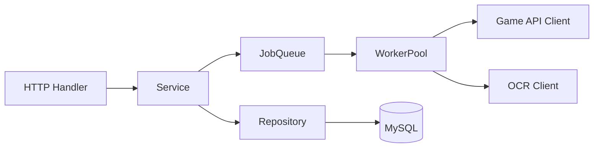

# wjdr-backend-go（Go 后端）

## 1. 项目简介
Go 实现的“无尽冬日自动化兑换平台”后端，高并发、低延迟，采用异步任务与 Worker 池，避免请求阻塞。

## 2. 技术栈
- Gin（HTTP）
- database/sql + go-sql-driver/mysql（MySQL）
- robfig/cron/v3（定时任务）
- zap（日志）
- Viper（配置）
- Prometheus/pprof（可选）

## 3. 架构概览
- handler → service → repository → client（游戏 API/OCR）
- JobQueue + WorkerPool（异步批处理）



## 4. 运行与配置
- 环境变量（示例）：
```
PORT=3001
DB_HOST=...
DB_PORT=3306
DB_USER=...
DB_PASSWORD=...
DB_NAME=wjdr_platform
OCR_BAIDU_API_KEY=...
OCR_BAIDU_SECRET_KEY=...
HTTP_READ_TIMEOUT=10s
HTTP_WRITE_TIMEOUT=15s
DB_MAX_OPEN_CONNS=50
DB_MAX_IDLE_CONNS=20
WORKER_CONCURRENCY=16
RATE_LIMIT_QPS=8
```

- 启动：
```
make run   # 或 go run ./cmd/server
```

## 5. API 兼容说明
- /api/accounts, /api/redeem, /api/admin 与现有 Node 语义一致。
- /api/redeem POST：仅入队并返回 taskId；后台异步处理。

## 6. 核心实现要点
- sign 生成规则与 Node 等价（按键排序 + salt + MD5）。
- 任务模型包含：redeem_code_id、account_ids、is_retry、创建者、幂等键等。
- fatal error 短路、验证码失败重试（≤3 次，退避）。
- 外部 API、DB、OCR 全链路超时与限流。

## 7. 监控与排障
- zap 结构化日志；
- /metrics（可选）暴露 Prometheus 指标：qps、队列深度、成功/失败计数、外部错误码分布；
- pprof（可选）在受控环境开启。

## 8. 部署建议
- 与 Node 并行灰度；
- 通过环境切换前端 API 基址完成流量迁移；
- 关键参数（并发/限流/超时）随环境调优。